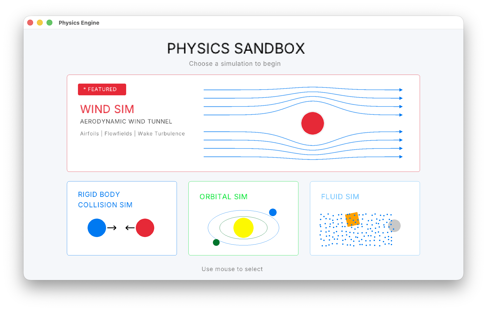

# Physics Sandbox

A physics sandbox written from scratch in C++ using Raylib to explore collision detection, orbital mechanics, fluid simulation, rendering techniques, and numerical methods.

## Features

### Rigid Body Collision Simulator
- Impulse-based collision resolution
- Dynamic and static rigid bodies
- Adjustable mass and restitution
- Drag-and-launch spawning system
- Velocity vector visualization
- Pause and frame stepping controls
- Interactive object selection and inspection

### Orbital Simulator
- Newtonian gravitational simulation
- Stable circular orbit generation
- N-body gravitational interactions
- Real-time orbit prediction
- Velocity vector visualization
- Adjustable time scaling
- Persistent orbital trail rendering
- Interactive body spawning and selection

### Fluid Simulator 
- Particle-based fluid simulation
- Density and pressure calculations
- Uniform spatial grid acceleration structure
- Viscosity modeling
- Buoyancy and rigid body interaction
- Rotating floating objects
- Metaball shader rendering
- Interactive mouse stirring
- Real-time fluid rendering at interactive frame rates

## Wind Simulator
- Adjustable wind speed, particle count, and airfoil angle of attack
- Four obstacle types: circle, square, diamond, and NACA 0012 airfoil
- Real-time particle-based airflow with streamline visualization and particle trails
- Surface-following collision response using normals and tangential velocity projection
- Speed and pressure visualization modes for comparing flow behavior
- Lift and drag force calculations with real-time force vector visualization
- Simplified aerodynamic stall model demonstrating lift loss and drag increase at high angles of attack
- Interactive comparison of flow behavior and aerodynamic forces across different obstacle geometries
- Built in C++ with raylib using a custom particle-based physics and visualization system

## Built With

- C++
- Raylib
- CMake
- GLSL shaders

## Project Goals

This project is being developed as a long-term learning project to explore:

- Physics simulation
- Collision detection
- Numerical integration
- Rendering
- Interactive UI
- Software architecture

## Future Additions

- Navier-Stokes implementation
- Soft Body/Spring simulation
- Double pendulum simulation


## Screenshots
-Main Menu




## Collision Sandbox


## Ortbital Sandbox


## Fluid Sandbox


## Wind Sandbox


## How to Build

```bash
mkdir build
cd build
cmake ..
make
./PhysicsEngine
```

## Author

Nicholas Graves
