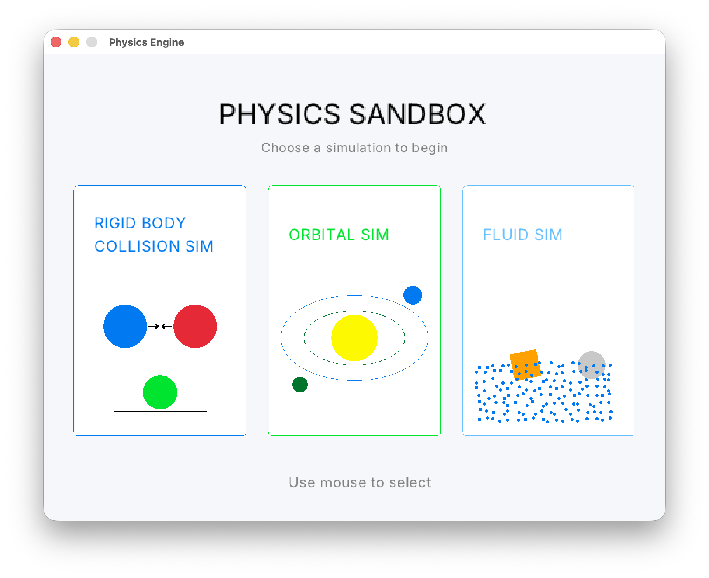
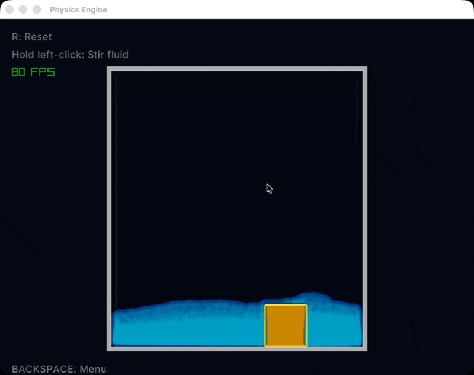

# Physics Sandbox

A physics sandbox written in C++ using Raylib.

This project is a collection of interactive physics simulations built to learn game physics, numerical simulation, and software architecture.

## Features

### Rigid Body Collision Simulator
- Circle-to-circle collisions
- Gravity
- Wall collisions
- Adjustable restitution
- Multiple dynamic bodies

### Orbital Simulator
- Newtonian gravity
- Stable orbits
- Multiple orbiting bodies
- Planet spawning

### Fluid Simulator (Work in Progress)
- Particle-based fluid
- Gravity
- Particle collisions
- Foundation for floating and sinking objects

## Built With

- C++
- Raylib
- CMake

## Project Goals

This project is being developed as a long-term learning project to explore:

- Physics simulation
- Collision detection
- Numerical integration
- Rendering
- Interactive UI
- Software architecture

Future simulations planned include:

- Soft body physics
- Cloth simulation
- Improved fluid dynamics
- Constraints and joints

## Screenshots
-Main Menu




## Collision Sandbox


## Ortbital Sandbox


## Fluid Sandbox




## How to Build

```bash
mkdir build
cd build
cmake ..
make
./PhysicsEngine
```

## Author

Nicholas Graves
